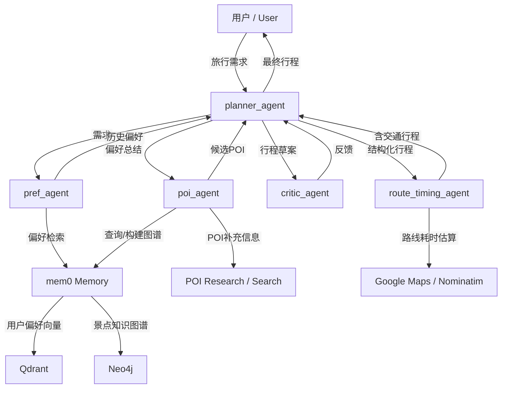

# Travel Planner: mem0 + Neo4j 多 Agent 行程规划系统

## 1. 项目简介

本项目是一个基于 AG2 多 Agent 协作框架的智能旅行规划系统。系统结合用户历史偏好、景点知识图谱、POI在线研究、规则化行程校验与路线耗时补全，生成结构化、可执行的多日旅行计划。

系统目标不是简单生成文本攻略，而是将“用户偏好记忆 + 目的地景点图谱 + 多 Agent 分工 + 规则 Critic”组合成一条行程规划流水线，提升推荐结果的个性化。

## 2. 系统架构

系统采用分层架构，核心由 Agent 编排层、记忆与图谱层、POI 研究层、结构化行程提交与校验层、路线补全层组成。



各层职责如下：

- Agent 编排层：使用 AG2 `DefaultPattern` 管理多 Agent 轮转、上下文变量和 handoff 条件。
- 记忆层：使用 Qdrant 保存用户旅行偏好，并在规划前召回最近偏好。
- 图谱层：使用 Neo4j 保存州、城市、景点、类别和地理邻近关系，为 `poi_agent` 提供候选 POI。
- POI 研究层：对候选景点进行在线检索、信息抽取、反思补查和结构化聚合。
- 结构化校验层：`planner_agent` 通过 tool schema 提交 `days/events` 结构化行程，`critic_agent` 用确定性规则检查可执行性、时间合理性、POI 合法性和地理连续性。
- 路线层：在景点事件之间插入交通事件，并补全步行、驾车或估算耗时。

## 3. 核心程序逻辑

`main()` 的执行流程可以概括为以下阶段：

1. 初始化运行上下文  
   构建可用州索引和城市到州的反向索引，校验 OpenAI 与 Neo4j 配置，并创建 mem0 客户端。

2. 准备用户偏好记忆  
   系统可清空本地 Qdrant 集合，并通过 `preload_reviews()` 将用户历史 review 分批写入 mem0，形成可召回的旅行偏好记忆。

3. 启动多 Agent 群聊  
   `DefaultPattern` 以 `pref_agent` 为初始 Agent，将 `trip_context` 作为共享状态，在最多 20 轮内完成偏好召回、目的地确认、图谱检索、结构化行程提交、校验和路线补全。

4. 偏好召回与规划启动  
   `pref_agent` 从 mem0 中读取最近用户偏好，写入 `context_variables["user_preferences"]`，再交给 `planner_agent`。`planner_agent` 负责确认目的地和旅行天数，并调用 `set_destination()` 更新目的地状态。

5. `poi_agent` 候选生成  
   当 `poi_handoff_needed` 为真时，`planner_agent` 交接给 `poi_agent`。该 Agent 会检查 Neo4j 中是否已有目的地州图谱；若没有，则从 Google Local 元数据构建景点图谱。随后结合用户偏好和目的地特征，查询高匹配度景点，并对 Top POI 执行在线研究。

6. 行程草案生成与 Critic 循环  
   `planner_agent` 只能使用 `poi_agent` 返回的 POI 名称生成日程草案，并必须通过 `submit_itinerary_for_critique(days=...)` 以 tool calling 形式提交 `Itinerary` schema 对应的 `days/events` 结构。`critic_agent` 随后调用规则引擎评估草案；若发现硬约束或软约束问题，反馈会回流给 `planner_agent` 进行局部修复。

7. 确认行程与路线补全  
   当用户确认行程后，`planner_agent` 调用 `mark_itinerary_as_complete()` 复用最近一次结构化草案写入 `structured_itinerary`，并直接交给 `route_timing_agent`。`route_timing_agent` 调用 `update_itinerary_with_travel_times()` 在相邻景点之间插入 `Travel` 事件，并生成最终 `timed_itinerary`。

## 4. 技术栈

- AG2 / AutoGen：多 Agent 对话、工具调用和 handoff 编排。
- mem0：统一管理用户记忆、向量检索和图谱访问。
- Qdrant：本地向量存储，用于用户偏好召回。
- Neo4j：景点知识图谱，保存州、景点、类别和邻近关系。
- LLM：用于行程规划决策、结构化 tool 调用和 POI 信息抽取。
- Pydantic：定义并校验结构化行程 schema。
- Google Maps Directions API：优先用于真实路线耗时估计。
- Nominatim + Haversine：在缺少 Directions API 时提供路线估算兜底。

## 5. 关键模块说明

- `main_mem0.py`  
  系统主编排文件，定义 mem0 配置、共享上下文、Agent、handoff 规则、`poi_agent` 回复逻辑和 `main()` 入口。

- `preload_memories.py`  
  从用户 review JSONL 中提取旅行经历，按批次写入 mem0，用于后续偏好召回。

- `graph_builder.py`  
  从 Google Local 景点元数据构建图谱输入，包括州索引、城市索引、景点节点和基于 Haversine 距离的 `NEAR` 关系。

- `poi_research/`  
  对候选 POI 进行在线研究。流程包括研究因子规划、搜索 query 生成、搜索结果抽取、反思补查、信息聚合和结构化输出。

- `critic_rules.py`  
  确定性行程评估器，检查 JSON 格式、POI 是否来自候选集、每日景点数量、时间窗口、开放时间、重复 POI、地理跳跃、换乘缓冲和类别多样性。

- `itinerary_models.py`  
  定义 `Event`、`Day`、`Itinerary` 数据模型；其中 `Day/Event` 也作为 `planner_agent` 结构化 tool schema 的核心字段，并负责在结构化行程中插入交通事件和路线耗时。

## 6. 快速开始

1. 进入项目目录：

```bash
cd /data/lrh/build-with-ag2-main/travel-planner
```

2. 安装依赖：

```bash
pip install -r requirements.txt
```

运行环境还需要包含 `mem0`、`python-dotenv`、`requests` 及 Neo4j 相关依赖。

3. 配置环境变量：

```bash
OPENAI_API_KEY=...
OPENAI_BASE_URL=...
NEO4J_URL=...
NEO4J_USERNAME=...
NEO4J_PASSWORD=...
NEO4J_DATABASE=...
GOOGLE_MAP_API_KEY=...   # 可选
```

4. 启动 `main()` 主流程：

```bash
python -c "import main_mem0; main_mem0.main()"
```

当前 `main()` 使用代码中的示例请求启动群聊；更换旅行需求时，可调整 `initiate_group_chat(..., messages=...)` 中的初始消息。

## 7. 项目亮点

- 多 Agent 分工明确：偏好召回、规划、图谱检索、规则校验和路线补全分别由独立 Agent 或工具承担。
- 混合检索架构：同时利用向量记忆捕获用户偏好，利用 Neo4j 图谱约束景点候选和地理关系。
- 图谱按需构建：目的地州图谱不存在时才从元数据构建，降低启动成本并复用已有图谱。
- 候选来源可控：规划 Agent 被限制只能使用 `poi_agent` 返回的研究过 POI，减少幻觉景点。
- 结构化输出前置：`planner_agent` 通过 `submit_itinerary_for_critique` 的 tool schema 直接提交 `days/events`，减少自然语言转 JSON 的中间层。
- Critic 闭环稳定：确定性规则输出可执行反馈，并通过重试上限和降级机制避免无限修订。
- 输出可执行：最终行程以 Pydantic schema 表达，并自动补全景点间交通事件和耗时估算。
